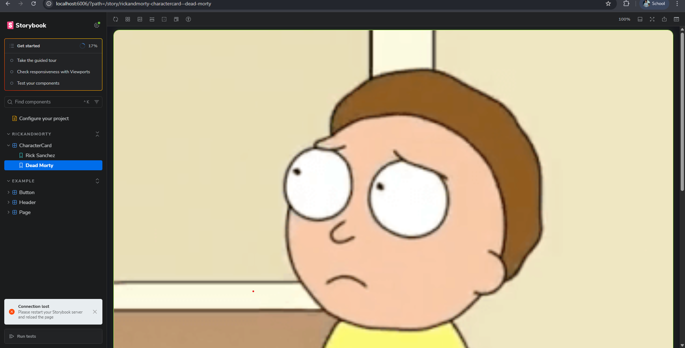

<div align="center">
  <h1>Rick and Morty Portal (Vue Edition)</h1>
  <p><strong>A polished character explorer built with Vue 3, Vite, and a production-style frontend workflow.</strong></p>
  <p>
    <a href="https://rick-and-morty-vue-wheat.vercel.app/#/">
      
    </a>
    
    
    
    
    
  </p>
</div>

## Live Preview
- Production URL: https://rick-and-morty-vue-wheat.vercel.app/#/



## Overview
This single-page application consumes the Rick and Morty API and focuses on a clean UX with fast navigation, resilient loading/error handling, and maintainable component architecture.

## Features
- Hash-based route system with dedicated pages for:
  - `#/` (character explorer)
  - `#/about`
  - `#/character/:id` (detail view)
- Search with debounced input for smoother API traffic
- Status filtering (`Alive`, `Dead`, `Unknown`) and pagination controls
- Character detail page with origin, location, type, and episode count
- Skeleton loading UI and retry actions for failed requests
- Empty-state experience for no-match searches
- Storybook stories for reusable UI components
- Unit/component tests with Vitest + Vue Test Utils
- End-to-end tests with Playwright (API responses mocked for stable test runs)

## Tech Stack
- Vue 3 (Composition API)
- Vite
- ESLint + Prettier
- Vitest + Vue Test Utils
- Playwright
- Storybook

## Getting Started
### Prerequisites
- Node.js 20+ recommended
- npm

### Install and Run
```bash
npm install
npm run dev
```

App runs at `http://localhost:5173` by default.

## Available Scripts

| Script | Description |
| --- | --- |
| `npm run dev` | Start the Vite development server. |
| `npm run build` | Create production build output. |
| `npm run preview` | Preview the production build locally. |
| `npm run lint` | Run ESLint checks across the project. |
| `npm run lint:fix` | Auto-fix lint issues where possible. |
| `npm run format` | Format source files with Prettier. |
| `npm run format:check` | Check formatting without modifying files. |
| `npm run test` | Alias for `npm run test:unit`. |
| `npm run test:unit` | Run unit and component tests. |
| `npm run test:e2e` | Run Playwright end-to-end tests. |
| `npm run test:all` | Run Vitest in full run mode. |
| `npm run test:storybook` | Run Storybook-focused browser tests. |
| `npm run storybook` | Launch Storybook locally on port 6006. |
| `npm run build-storybook` | Build static Storybook files. |

## Environment Configuration
You can override the default API endpoint by defining:

```bash
VITE_API_BASE_URL=https://rickandmortyapi.com/api
```

If omitted, the app defaults to `https://rickandmortyapi.com/api`.

## Continuous Integration
GitHub Actions workflow: `.github/workflows/ci.yml`

Trigger conditions:
- Pull requests targeting `main`
- Manual run via `workflow_dispatch`

Current pipeline checks:
- Install dependencies (`npm ci`)
- Format step (`npm run format --if-present`)
- Linting (`npm run lint --if-present`)
- Unit tests (`npm run test:unit --if-present`)
- Production build (`npm run build`)

## Project Structure
```text
my-app-vue/
|- .github/workflows/ci.yml
|- docs/screenshots/
|- e2e/
|- public/
|- src/
|  |- components/
|  |- services/
|  |- App.vue
|  |- App.test.js
|  |- main.js
|  |- style.css
|- playwright.config.js
|- vite.config.js
|- vitest.config.js
|- package.json
```

## Author
Dipshant Paudel
